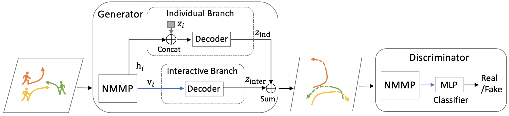

# NMMP
This repository contains the official PyTorch implementation of:


**<a href="https://arxiv.org/abs/2003.3086942">Collaborative Motion Predication via Neural Motion Message Passing</a>**
<br>
Yue Hu, Siheng Chen, Ya Zhang, Xiao Gu
<br>
Presented at [CVPR 2020 oral](http://cvpr2020.thecvf.com/)

<div align="center">

</div>


**Abstract:** Motion prediction is essential and challenging for autonomous vehicles and social robots. One challenge of motion prediction is to model the interaction among traffic actors, which could cooperate with each other to avoid collisions or form groups. To address this challenge, we propose neural motion message passing (NMMP) to explicitly model the interaction and learn representations for directed interactions between actors. Besides, we provide interpretability for interaction learning.

## Model
The two frameworks are the same system under two different settings. (1) Two frameworks use the same NMMP to model interactions, and share the same architecture: individual and interactive branches. (2) Two frameworks provide distinct wrappers to handle different input formats and characteristics. JMP considers urban-driving scenes, which requires additional map information. Thus, JMP includes CNNs, while PMP does not; JMP considers vehicles and pedestrians, which requires to handle vehicle headings. Thus, JMP includes coordinate transforms, while PMP does not; PMP considers open-area scenes, where human behaviours are more uncertain. Thus PMP includes GAN, while JMP does not. Overall, those differences between two frameworks are small variations.

### Pedestrian Motion Prediction



### Joint Pedestrian and Vehicle Motion Prediction
<div align="left">

</div>


## Requirements
- Pytorch 0.4.0
- Python 3.6

## Data Preparation

1. [ETH-UCY Dataset](https://www.dropbox.com/s/8n02xqv3l9q18r1/datasets.zip?dl=0) Provided by [SGAN](https://github.com/agrimgupta92/sgan/blob/master/scripts/download_data.sh)
2. Stanford Drone Dataset [Raw](https://github.com/amiryanj/StanfordDroneDataset), [Processed](https://github.com/vineetsk1/cs231a-project/tree/master/data/challenges/3)
2. [NuScenes Dataset](https://www.nuscenes.org/download)

## Train and test phases

```
# PMP_NMMP
# train 
CUDA_VISIBLE_DEVICES=0 python train.py --dataset_name=eth --num_layers=2 --pooling_type=nmp
# eval
CUDA_VISIBLE_DEVICES=0 python evaluate_model.py --model_path=./checkpoints/eth_with_model.pt

# JMP_NMMP
# train 
CUDA_VISIBLE_DEVICES=0 python train.py --encoder=nmp --use-nmp --mode=whole --tail=with_nmp
# eval
CUDA_VISIBLE_DEVICES=0 python train.py --encoder=nmp --use-nmp --mode=eval --restore --load-folder=exp0 --tail=with_nmp
```

## Citation

```
@inproceedings{CMPNMMP:20,
  author    = {Yue Hu, Siheng Chen, Ya Zhang, Xiao Gu},
  title     = {Collaborative Motion Predication via Neural Motion Message Passing},
  booktitle = {The IEEE Conference on Computer Vision and Pattern Recognition (CVPR)},
  month     = {June},  
  year      = {2020}
}
```

## References

1. SGAN: [Social GAN: Socially Acceptable Trajectories with Generative Adversarial Networks](https://github.com/agrimgupta92/sgan)
2. NRI code: [Neural Relational Inference for Interacting Systems](https://github.com/ethanfetaya/NRI)
3. NuScenes: [dataset](https://www.nuScenes.org/), [nuscenes-devkit](https://github.com/nutonomy/nuscenes-devkit)


## Contact

If you have any problem with this code, please feel free to contact **18671129361@sjtu.edu.cn**.


